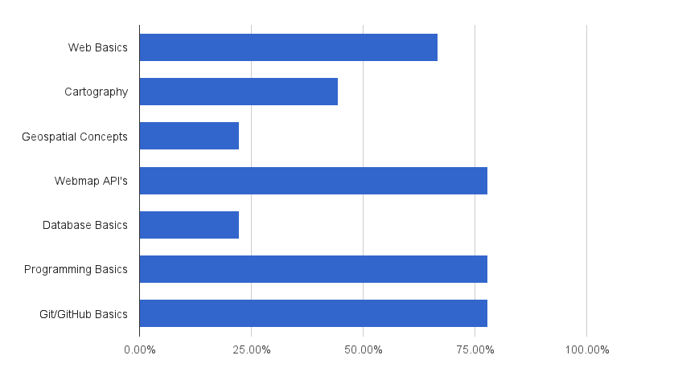
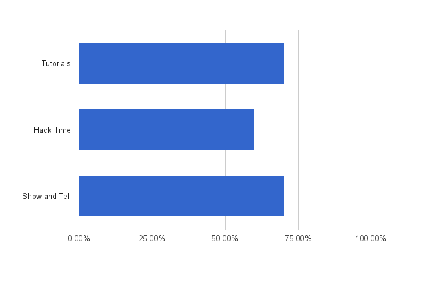
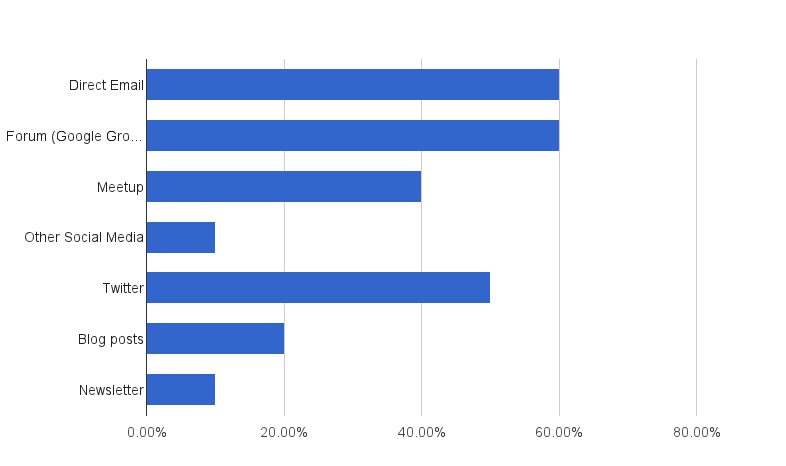
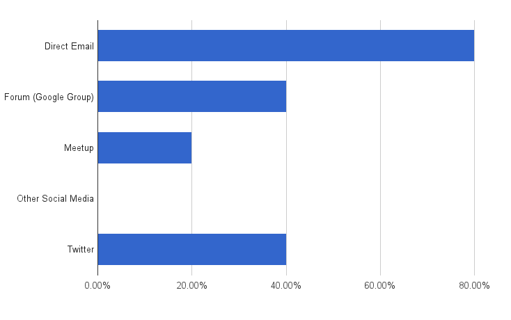

## In-Depth Survey Results
[(jump to the summary)](#Summary)

Total Responses: 10

### What do you most want to learn about?

Responses: 9/10

#### Respondent Comments

 - mobile

### What would you like to see more of?

Responses: 10/10

#### Respondent Comments

 - I love the idea of Hack time, but I think it sounds advanced to a lot of folks who might be scared off by it. Hack time might need a better name to be compatible with Maptime... Something like "problem solving" time?
 - I like all three -- usually in combination in a single session, e.g. Tutorial + Hack Time Show-and-Tell + Hack Time
 - I think that being involved in a project will help me best learn concepts, tools, and methods.
 - I haven't attended much but when I have I see new people that are interested but maybe aren't taking that next step. Consider pairing people up or doing a 'speed dating' style round-robin to introduce folks and see if there is a match on projects whether mentor/learner or collaborators. Get side or group projects going outside of meetups. Get that energy building The Portland Python Mentoring group has an interesting structure. People pair up at the beginning of the night and work together on something.

### How would you prefer we communicate with you, the community?

Responses: 10/10

#### Respondent Comments

 - Obviously the more local the better!
 - calagator is fantastic; am not fond of google groups
 - It would be interesting and inspiring to receive a newsletter that summarizes what was covered/done at MapTime events and describes projects people are working on. Of course, this would take a considerable amount of work to produce.

### How would you prefer to communicate with us, the organizers?

Responses: 10/10

### What are we doing well?

 - Communicating and being responsive to user needs by doing surveys like this...
 - Good space.
 - not yet sure
 - Being all-around awesome (sorry, I know that's vague. But it's true.)
 - Keeping it going!

### How can we improve?

 - The newbie-friendly tone at Maptime is part of it's awesomeness, but I wonder if over time, as people learn the basics, are you finding that people want more "intermediate" content? or are there just always new people with intermediates drifting off? #showerthought
 - Workgroups to help develop projects, better preparation and description of topics.
 - I feel like I always see Maptime dates... the day after they've happened. I'm trying to be more proactive about it -- it might just be me.
 - Being more inclusive of the non-hacker/inexperienced but interested. It is very intimidating being in a room of very experienced and intelligent people and having a hack session and not knowing where you fit in as you've not done any of the work before. I recognize that this might not be interesting for all attendees, but maybe a quarterly 'beginner night' would be enticing for those interested.
 - More engaging speaking style, more hands-on, more discussion built-in, get people excited! Standard 40 minute talk after work is recipe for tiredness. If maptime is trying to be different, let's see it!

### Anything else you would like to tell us?

 - If all the Maptimes are doing this survey, would love to see the answers to question 1 as a bar chart for all of Maptime, and also for Maptime by city, to see if there are geographic differences in what people are interested in. No matter what, you should present the results at a Maptime!
 - Keep up the good work!
 - I've been unable to make it for some time so perhaps you've done some of the things I've suggested. You're doing a great job creating a meeting space and community. Keep it up. Yer the tops!
 - Thank you for putting in the time to organize MapTimePDX! This is a great survey! Good job! :-)
 - Appreciate your guys' energy and persistence. Optimally you want to get to where the group has a life of its own. Monthly meetups become a focal point and not the only thing. More collaboration with the PDX OSGEO group. There's some overlap in the group and continuing to be inclusive will only help as its a small community. The OSM import event is an example. Consider billing it as a collaboration and looking for more of those opportunities. Also people at the OSGEO meetings have asked for the types of intro talk that maptime is providing. Consider posting maptime events on the OSGIS list and being that channel for the OSGEO group.

## tl;dr

We ran a feedback survey in November to get a better idea of where we should MaptimePDX in 2015. Here is a quick summary of the results. 

##### What do you most want to learn about?
 - People would like to learn about git/github, web map api's (such as Leaflet), programming basics (i.e. python), and web basics (html, css, etc). 

##### What would you like to see more of?
 - People are fans of tutorials and show & tells. Slightly less so of hack-times. 

##### How would you prefer to send/receive communications?
 - Email, the Google Group, and Twitter are the prefered methods of communication (we'll be bringing Eventbrite into the mix for a trial run too). On a side note, we have a new option for emailing us: hello+maptimepdx@maptime.io will direct to the organizers.

##### What are we doing well?
 - It sounds like we're doing well in general.

##### How can we improve?
 - Ideas for improvement include making sure we keep beginners in mind, improved planning/preparation, shorten presentations (40+ minutes is too long), and workgroups/mentorships.

#### Our Take-Aways

 - 
